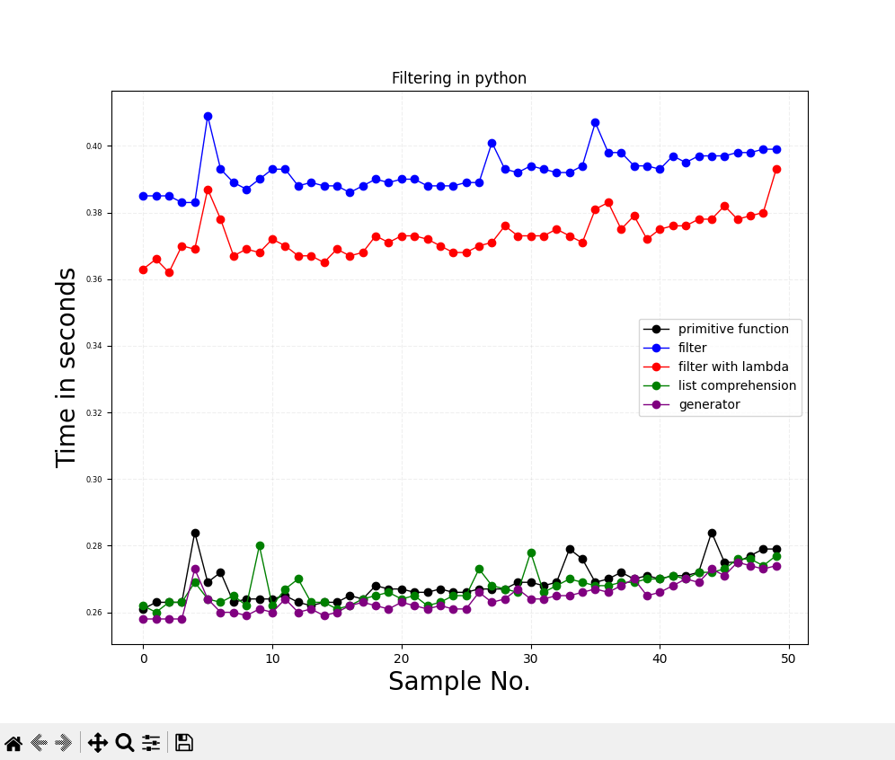

# Comparing filtering ways in Python
This repo is created for storing code and data for blog post in https://devops-journal.pl

# TODO
- [ ] filtering nested dicts
- [ ] what about generators while filtering strings? Why are they faster?
- [ ] structure data (json files) so everybody can use it properly

# Charts

## filtering string by `endswith`
- samples: `50`
- size of list: `5000000 -> 5 mln`

## filtering odd numbers
Remember! Generator is casted to list so you lost all advantages of creating generator. It's just for chart purposes!

